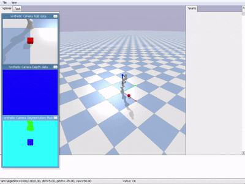

# VLM Manipulation System
A Vision-Language Manipulation System that combines OpenVLA, computer vision, inverse kinematics, and robotic control to perform autonomous pick-and-place tasks in a PyBullet simulation environment.

<p align="center">
  
</p>

<p align="center">
  <em>Vision-Language guided robotic manipulation using OpenVLA and PyBullet.</em>
</p>

---

## Overview

This project explores the integration of Vision-Language-Action (VLA) models into robotic manipulation workflows.

The system observes the workspace through a simulated camera, interprets natural language instructions, generates robot actions using OpenVLA, and executes manipulation tasks through inverse kinematics and motion control.

The objective is to demonstrate how modern multimodal AI systems can bridge perception and action for autonomous robotic manipulation.

---

## Features

* Vision-Language Action generation using OpenVLA
* Natural language instruction understanding
* Real-time workspace perception
* Franka Panda robot simulation
* Inverse kinematics based motion planning
* Autonomous pick-and-place execution
* End-to-end perception-to-action pipeline

---


## System Pipeline

```text
User Instruction
        ↓
Visual Observation
        ↓
OpenVLA
(Vision-Language-Action Model)
        ↓
Action Generation
        ↓
Robot Controller
        ↓
Inverse Kinematics
        ↓
PyBullet Simulation
        ↓
Object Manipulation
```


---

## Tech Stack

* Python
* OpenVLA
* PyTorch
* Hugging Face Transformers
* PyBullet
* NumPy
```

---

## Installation

```bash
git clone https://github.com/ritikashinde/VLM-Manipulation-System.git

cd VLM-Manipulation-System

pip install -r requirements-min.txt
```

---

## Running the Project

```bash
python main_controller.py
```

---

## Future Improvements

* Deployment on physical robotic hardware
* Multi-object manipulation
* Dynamic obstacle avoidance
* Sim-to-real transfer
* Advanced grasp planning
* Task sequencing for complex workflows

---

## Acknowledgements

This project builds upon OpenVLA, an open-source Vision-Language-Action model.

The repository focuses on the manipulation pipeline, simulation environment, robot control logic, and system integration developed around the foundation model.
